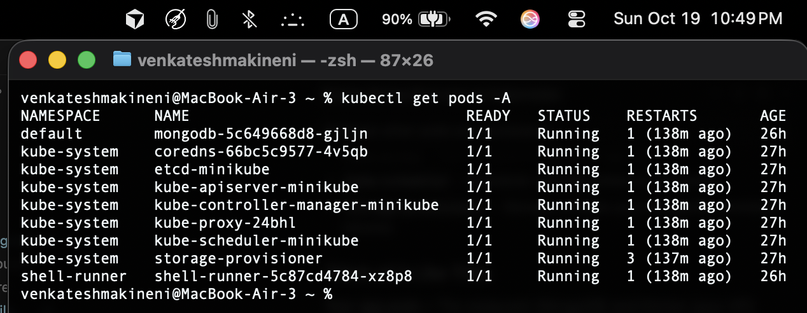
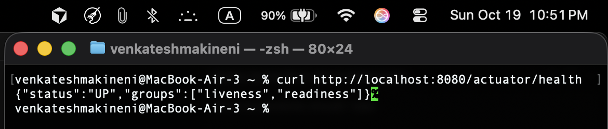
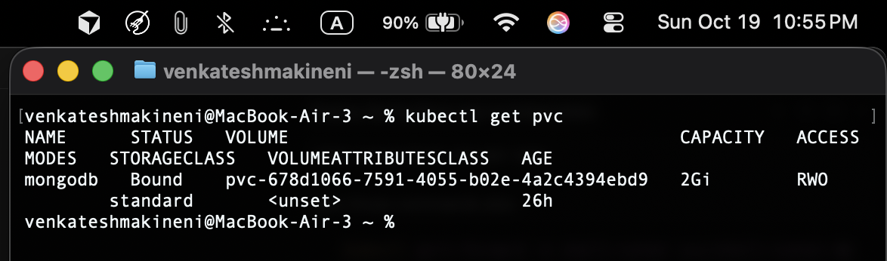
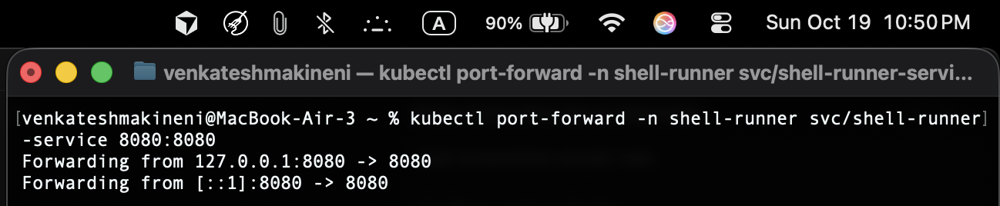

# Task API - Kubernetes Shell Command Runner

A Spring Boot REST API deployed on Kubernetes for managing and executing shell commands in Kubernetes pods with MongoDB persistence.

## 📋 Overview

This application provides a REST API for creating, managing, and executing shell commands in Kubernetes pods. Each task represents a shell command that runs in a separate Kubernetes pod using busybox containers, with execution history tracking stored in MongoDB.

## 🏗️ Architecture

- **Framework**: Spring Boot 3.5.6
- **Database**: MongoDB (deployed via Helm)
- **Language**: Java 21
- **Build Tool**: Maven
- **Container Platform**: Docker + Kubernetes (Minikube)
- **Command Execution**: Kubernetes Pods (busybox containers)
- **Client Library**: Fabric8 Kubernetes Client

## 📊 Data Models

### Task Object

```json
{
  "id": "123",
  "name": "Print Hello",
  "owner": "Venkatesh Makineni",
  "command": "echo Hello World!",
  "taskExecutions": [
    {
      "startTime": "2025-10-18T15:51:42.276Z",
      "endTime": "2025-10-18T15:51:43.276Z",
      "output": "Hello World!"
    }
  ]
}
```

### TaskExecution Object

- **startTime**: Execution start date/time (Date)
- **endTime**: Execution end date/time (Date)
- **output**: Command output (String)

## 🚀 API Endpoints

### 1. GET /tasks

**Description**: Retrieve all tasks or a specific task by ID

**Parameters**:

- `id` (optional): Task ID to retrieve specific task

**Examples**:

```bash
# Get all tasks
curl -X GET "http://localhost:8080/tasks"

# Get specific task
curl -X GET "http://localhost:8080/tasks?id=123"
```

**Response**: List of tasks or single task object

---

### 2. PUT /tasks

**Description**: Create or update a task

**Request Body**: Task object in JSON format

**Example**:

```bash
curl -X PUT "http://localhost:8080/tasks" \
  -H "Content-Type: application/json" \
  -d '{
    "id": "123",
    "name": "Print Hello",
    "owner": "Venkatesh Makineni",
    "command": "echo Hello World!"
  }'
```

**Response**: Created/updated task object

---

### 3. DELETE /tasks

**Description**: Delete a task by ID

**Parameters**:

- `id`: Task ID to delete

**Example**:

```bash
curl -X DELETE "http://localhost:8080/tasks?id=123"
```

**Response**: 204 No Content

---

### 4. GET /tasks/find

**Description**: Find tasks by name (case-insensitive partial match)

**Parameters**:

- `name`: String to search for in task names

**Example**:

```bash
curl -X GET "http://localhost:8080/tasks/find?name=Hello"
```

**Response**: List of matching tasks

---

### 5. PUT /tasks/execute

**Description**: Execute a task's shell command in a Kubernetes pod

**Parameters**:

- `id`: Task ID to execute

**Example**:

```bash
curl -X PUT "http://localhost:8080/tasks/execute?id=123"
```

**Response**: Updated task object with new execution result

**How it works**:

- Creates a new Kubernetes pod with busybox image
- Runs the command inside the pod
- Captures output and logs
- Automatically deletes the pod after execution
- Stores execution result in MongoDB

## 🔒 Security Features

The API includes comprehensive security validation to prevent malicious commands:

- **Blocked Commands**: File deletion (`rm`), system commands (`sudo`, `shutdown`), network operations (`curl`, `wget`), and more
- **Command Length Limit**: Maximum 250 characters
- **Pattern Matching**: Detects dangerous command patterns

**Security Error Response**:

```json
{
  "status": 400,
  "error": "Bad Request",
  "message": "Security violation: Command is not safe 'rm '"
}
```

## 📱 Kubernetes Deployment Screenshots

The following screenshots demonstrate the Kubernetes deployment and functionality:

| Description                      | Screenshot                                                      |
| -------------------------------- | --------------------------------------------------------------- |
| All Kubernetes pods running      |            |
| Application health check         |         |
| Task creation via API            |              |
| Task execution in Kubernetes pod |            |
| Persistent volume for MongoDB    |  |
| Port forwarding setup            |         |

## 🛠️ Kubernetes Deployment Instructions

### Prerequisites

- **Java 21** or higher
- **Maven 3.6+**
- **Docker** installed
- **Minikube** installed
- **kubectl** installed
- **Helm** installed

### Kubernetes Deployment Steps

#### 1. Start Minikube Cluster

```bash
minikube start --driver=qemu2
minikube status
```

#### 2. Build Docker Image

```bash
# Navigate to project directory
cd task-api

# Build Docker image in minikube context
eval $(minikube docker-env)
docker build -t shell-runner:latest .
```

#### 3. Deploy MongoDB via Helm

```bash
# Add Bitnami repository
helm repo add bitnami https://charts.bitnami.com/bitnami
helm repo update

# Install MongoDB with persistence
helm install mongodb bitnami/mongodb \
  --set auth.enabled=false \
  --set persistence.enabled=true \
  --set persistence.size=2Gi
```

#### 4. Deploy Application

```bash
# Apply Kubernetes manifests
kubectl apply -f k8s-configmap.yaml
kubectl apply -f k8s-rbac.yaml
kubectl apply -f k8s-deployment.yaml
kubectl apply -f k8s-service.yaml
```

#### 5. Verify Deployment

```bash
# Check pods are running
kubectl get pods -A

# Check services
kubectl get svc -n shell-runner

# Check persistent volumes
kubectl get pvc
```

#### 6. Access Application

```bash
# Port forward to access from host
kubectl port-forward -n shell-runner svc/shell-runner-service 8080:8080 &

# Test health endpoint
curl http://localhost:8080/actuator/health
```

### Local Development (Optional)

For local development without Kubernetes:

```bash
# Start MongoDB locally
mongod

# Run with local profile
mvn spring-boot:run -Dspring-boot.run.profiles=local
```

## 📖 How to Use the API

### Quick Start Guide

1. **Ensure Kubernetes deployment is running** (follow deployment steps above)
2. **Start port forwarding**: `kubectl port-forward -n shell-runner svc/shell-runner-service 8080:8080 &`
3. **Use any HTTP client** (curl, Postman, browser, etc.)
4. **Send requests** to the appropriate endpoints

### API Usage Examples

#### 1. Create Your First Task

```bash
curl -X PUT "http://localhost:8080/tasks" \
  -H "Content-Type: application/json" \
  -d '{
    "id": "hello-world",
    "name": "Hello World Task",
    "owner": "Your Name",
    "command": "echo Hello from Task API!"
  }'
```

**Expected Response**:

```json
{
  "id": "hello-world",
  "name": "Hello World Task",
  "owner": "Your Name",
  "command": "echo Hello from Task API!",
  "taskExecutions": []
}
```

#### 2. View All Tasks

```bash
curl -X GET "http://localhost:8080/tasks"
```

#### 3. Execute a Task

```bash
curl -X PUT "http://localhost:8080/tasks/execute?id=hello-world"
```

**Expected Response**:

```json
{
  "id": "hello-world",
  "name": "Hello World Task",
  "owner": "Your Name",
  "command": "echo Hello from Task API!",
  "taskExecutions": [
    {
      "startTime": "2025-10-18T12:00:00.000Z",
      "endTime": "2025-10-18T12:00:00.150Z",
      "output": "Hello from Task API!"
    }
  ]
}
```

**Note**: The command executes in a Kubernetes pod using busybox container, not locally.

#### 4. Search Tasks by Name

```bash
curl -X GET "http://localhost:8080/tasks/find?name=Hello"
```

#### 5. Get Specific Task

```bash
curl -X GET "http://localhost:8080/tasks?id=hello-world"
```

#### 6. Delete a Task

```bash
curl -X DELETE "http://localhost:8080/tasks?id=hello-world"
```

### Using with Postman

1. **Import the API**:

   - Create new collection in Postman
   - Add requests for each endpoint
   - Set base URL: `http://localhost:8080`

2. **Set Headers**:

   - For PUT requests: `Content-Type: application/json`

3. **Test Security**:
   - Try creating tasks with malicious commands
   - Verify they are blocked with 400 error

### Using with Browser

- **GET requests** can be tested directly in browser:
  - `http://localhost:8080/tasks`
  - `http://localhost:8080/tasks?id=hello-world`

### Error Handling

The API returns appropriate HTTP status codes:

- **200 OK**: Successful operations
- **204 No Content**: Successful deletion
- **400 Bad Request**: Invalid input or security violations
- **404 Not Found**: Resource not found
- **500 Internal Server Error**: Server errors

## 🧪 Complete Testing Workflow

```bash
# 1. Create a task
curl -X PUT "http://localhost:8080/tasks" \
  -H "Content-Type: application/json" \
  -d '{
    "id": "test1",
    "name": "Test Command",
    "owner": "Developer",
    "command": "echo Hello from Task API!"
  }'

# 2. Get all tasks
curl -X GET "http://localhost:8080/tasks"

# 3. Execute the task
curl -X PUT "http://localhost:8080/tasks/execute?id=test1"

# 4. Find tasks by name
curl -X GET "http://localhost:8080/tasks/find?name=Test"

# 5. Delete the task
curl -X DELETE "http://localhost:8080/tasks?id=test1"
```

## 🔍 Error Handling

The API provides comprehensive error handling:

- **404 Not Found**: When task ID doesn't exist
- **400 Bad Request**: For security violations or invalid input
- **500 Internal Server Error**: For unexpected errors

## 📝 Project Structure

```
task-api/
├── Dockerfile                              # Container build instructions
├── .dockerignore                           # Docker ignore file
├── pom.xml                                 # Maven configuration
├── README.md                               # Documentation
├── mvnw                                    # Maven wrapper (Unix)
├── mvnw.cmd                                # Maven wrapper (Windows)
├── k8s-configmap.yaml                      # Application configuration
├── k8s-rbac.yaml                           # ServiceAccount and permissions
├── k8s-deployment.yaml                     # Application deployment
├── k8s-service.yaml                        # Service exposure
├── docs/screenshots/                       # Screenshots (6 files)
│   ├── 01-kubectl-get-pods.png
│   ├── 02-health-endpoint.png
│   ├── 03-create-task.png
│   ├── 04-execute-task.png
│   ├── 05-persistent-volume.png
│   └── port-forwarding.png
└── src/main/
    ├── java/com/venkatesh/shellrunner/
    │   ├── api/
    │   │   └── TaskController.java          # REST endpoints
    │   ├── core/
    │   │   ├── Task.java                   # Task entity
    │   │   ├── TaskExecution.java          # TaskExecution entity
    │   │   └── TaskProcessor.java          # Business logic
    │   ├── data/
    │   │   └── TaskRepository.java         # MongoDB repository
    │   ├── execution/
    │   │   ├── CommandExecutor.java        # Local execution (local profile)
    │   │   ├── KubernetesExecutor.java     # Kubernetes execution (k8s profile)
    │   │   └── TaskExecutor.java          # Execution interface
    │   ├── config/
    │   │   └── ExecutorConfig.java         # Profile-based configuration
    │   ├── security/
    │   │   └── SecurityChecker.java        # Command validation
    │   ├── errors/
    │   │   ├── ErrorHandler.java          # Exception handling
    │   │   └── ResourceNotFoundException.java
    │   └── ShellRunnerApplication.java     # Main application class
    └── resources/
        ├── application.properties          # Main configuration
        ├── application-local.properties    # Local profile config
        └── application-k8s.properties     # Kubernetes profile config
```

## 🎯 Key Features

- ✅ **Complete CRUD Operations** for tasks
- ✅ **Kubernetes Pod Execution** - Commands run in separate pods using busybox
- ✅ **Profile-based Execution** - Local vs Kubernetes execution modes
- ✅ **Execution History Tracking** with timestamps
- ✅ **MongoDB Persistence** with persistent volumes
- ✅ **RBAC Security** - ServiceAccount with pod management permissions
- ✅ **Docker Containerization** - Multi-stage build with security best practices
- ✅ **Comprehensive Error Handling** with proper HTTP status codes
- ✅ **RESTful API Design** following best practices
- ✅ **Input Validation** and security checks
- ✅ **Automatic Pod Cleanup** - Execution pods are deleted after completion
