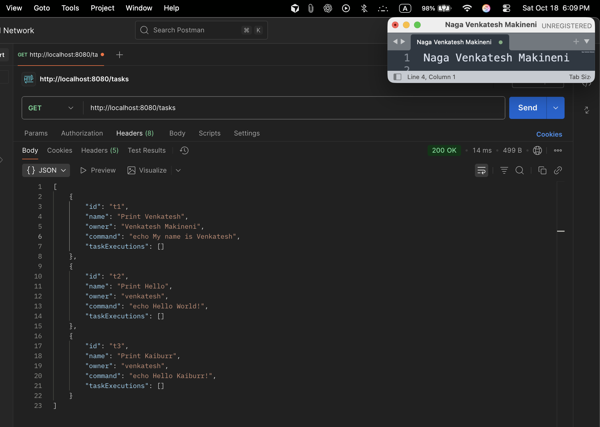
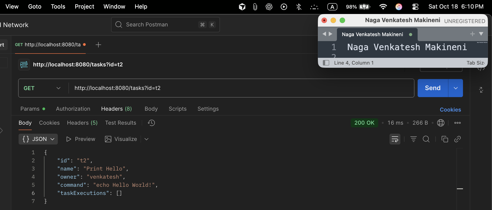
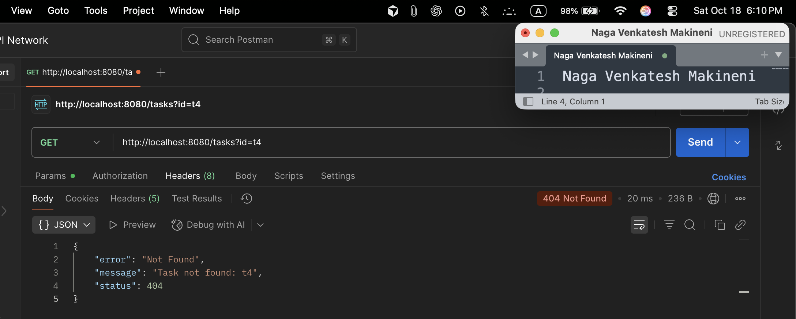
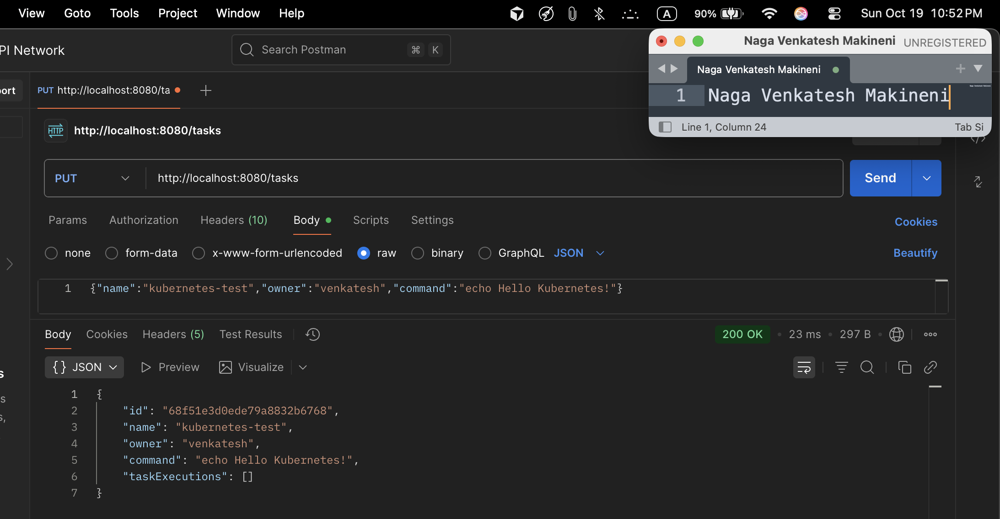
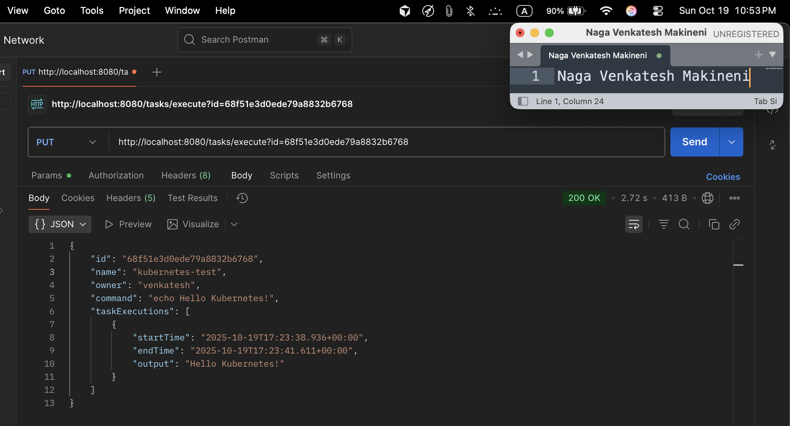
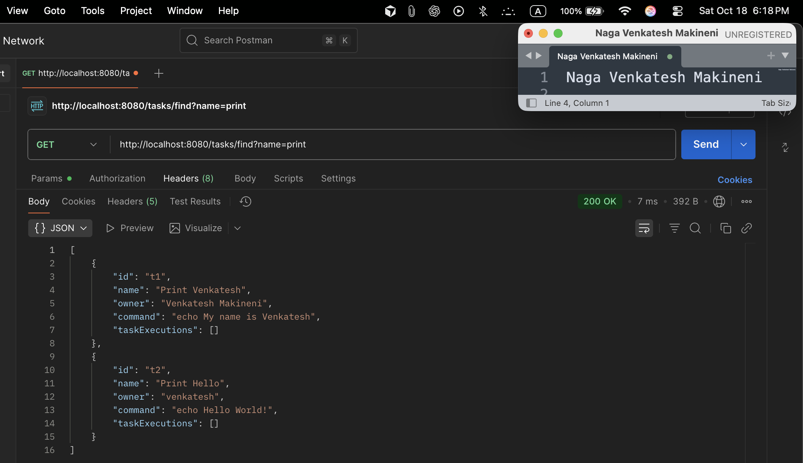
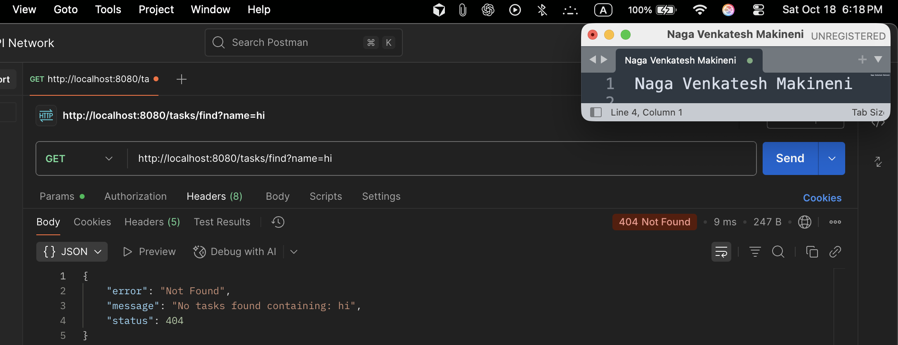
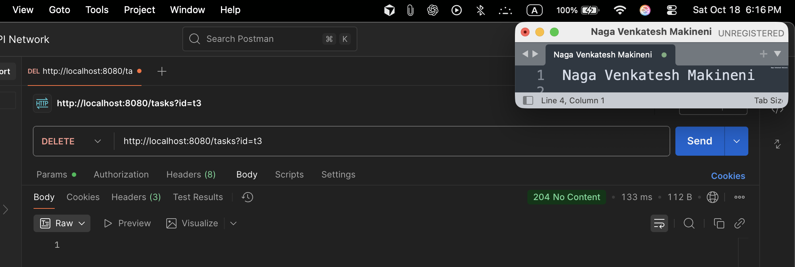
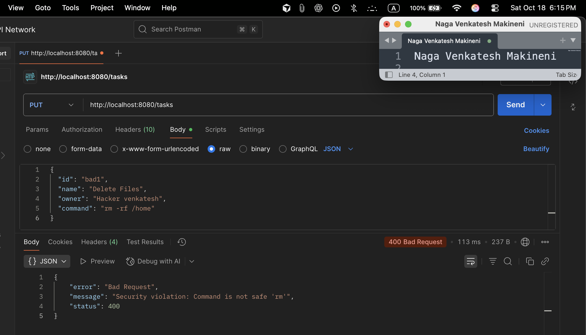

# Task API - Shell Command Runner

A Spring Boot REST API for managing and executing shell commands with MongoDB persistence.

## 📋 Overview

This application provides a REST API for creating, managing, and executing shell commands in a secure environment. Each task represents a shell command that can be run, with execution history tracking.

## 🏗️ Architecture

- **Framework**: Spring Boot 3.5.6
- **Database**: MongoDB
- **Language**: Java 21
- **Build Tool**: Maven

## 📊 Data Models

### Task Object

```json
{
  "id": "123",
  "name": "Print Hello",
  "owner": "Venkatesh Makineni",
  "command": "echo Hello World!",
  "taskExecutions": [
    {
      "startTime": "2025-10-18T15:51:42.276Z",
      "endTime": "2025-10-18T15:51:43.276Z",
      "output": "Hello World!"
    }
  ]
}
```

### TaskExecution Object

- **startTime**: Execution start date/time (Date)
- **endTime**: Execution end date/time (Date)
- **output**: Command output (String)

## 🚀 API Endpoints

### 1. GET /tasks

**Description**: Retrieve all tasks or a specific task by ID

**Parameters**:

- `id` (optional): Task ID to retrieve specific task

**Examples**:

```bash
# Get all tasks
curl -X GET "http://localhost:8080/tasks"

# Get specific task
curl -X GET "http://localhost:8080/tasks?id=123"
```

**Response**: List of tasks or single task object

---

### 2. PUT /tasks

**Description**: Create or update a task

**Request Body**: Task object in JSON format

**Example**:

```bash
curl -X PUT "http://localhost:8080/tasks" \
  -H "Content-Type: application/json" \
  -d '{
    "id": "123",
    "name": "Print Hello",
    "owner": "Venkatesh Makineni",
    "command": "echo Hello World!"
  }'
```

**Response**: Created/updated task object

---

### 3. DELETE /tasks

**Description**: Delete a task by ID

**Parameters**:

- `id`: Task ID to delete

**Example**:

```bash
curl -X DELETE "http://localhost:8080/tasks?id=123"
```

**Response**: 204 No Content

---

### 4. GET /tasks/find

**Description**: Find tasks by name (case-insensitive partial match)

**Parameters**:

- `name`: String to search for in task names

**Example**:

```bash
curl -X GET "http://localhost:8080/tasks/find?name=Hello"
```

**Response**: List of matching tasks

---

### 5. PUT /tasks/execute

**Description**: Execute a task's shell command

**Parameters**:

- `id`: Task ID to execute

**Example**:

```bash
curl -X PUT "http://localhost:8080/tasks/execute?id=123"
```

**Response**: Updated task object with new execution result

## 🔒 Security Features

The API includes comprehensive security validation to prevent malicious commands:

- **Blocked Commands**: File deletion (`rm`), system commands (`sudo`, `shutdown`), network operations (`curl`, `wget`), and more
- **Command Length Limit**: Maximum 250 characters
- **Pattern Matching**: Detects dangerous command patterns

**Security Error Response**:

```json
{
  "status": 400,
  "error": "Bad Request",
  "message": "Security violation: Command is not safe 'rm '"
}
```

## 📱 API Testing with Postman

### Screenshots

The following screenshots demonstrate the API functionality:

| Endpoint                   | Description         | Screenshot                                                          |
| -------------------------- | ------------------- | ------------------------------------------------------------------- |
| GET /tasks                 | Get all tasks       |              |
| GET /tasks?id=t2           | Get task by ID      |            |
| GET /tasks/id=t4           | Task not found      |     |
| PUT /tasks                 | Create task         |                  |
| PUT /tasks/execute?id=t1   | Execute task        |                |
| GET /tasks/find?name=print | Find tasks by name  |    |
| GET /tasks/find?name=hi    | Task not found      |  |
| DELETE /tasks?id=t3        | Delete task         |                  |
| PUT /tasks (malicious)     | Security validation |  |

## 🛠️ Setup Instructions

### Prerequisites

- **Java 21** or higher
- **Maven 3.6+**
- **MongoDB 4.4+** running on localhost:27017

### How to Compile the Application

1. **Navigate to project directory**:

   ```bash
   cd task-api
   ```

2. **Compile the application**:

   ```bash
   mvn clean compile
   ```

3. **Run tests (optional)**:

   ```bash
   mvn test
   ```

4. **Package the application**:
   ```bash
   mvn clean package
   ```

### How to Run the Application

#### Using Maven (Development)

1. **Start MongoDB**:

   ```bash
   mongod
   ```

2. **Run the application**:
   ```bash
   mvn spring-boot:run
   ```

## 📖 How to Use the API

### Quick Start Guide

1. **Ensure the application is running** on `http://localhost:8080`
2. **Use any HTTP client** (curl, Postman, browser, etc.)
3. **Send requests** to the appropriate endpoints

### API Usage Examples

#### 1. Create Your First Task

```bash
curl -X PUT "http://localhost:8080/tasks" \
  -H "Content-Type: application/json" \
  -d '{
    "id": "hello-world",
    "name": "Hello World Task",
    "owner": "Your Name",
    "command": "echo Hello from Task API!"
  }'
```

**Expected Response**:

```json
{
  "id": "hello-world",
  "name": "Hello World Task",
  "owner": "Your Name",
  "command": "echo Hello from Task API!",
  "taskExecutions": []
}
```

#### 2. View All Tasks

```bash
curl -X GET "http://localhost:8080/tasks"
```

#### 3. Execute a Task

```bash
curl -X PUT "http://localhost:8080/tasks/execute?id=hello-world"
```

**Expected Response**:

```json
{
  "id": "hello-world",
  "name": "Hello World Task",
  "owner": "Your Name",
  "command": "echo Hello from Task API!",
  "taskExecutions": [
    {
      "startTime": "2025-10-18T12:00:00.000Z",
      "endTime": "2025-10-18T12:00:00.150Z",
      "output": "Hello from Task API!"
    }
  ]
}
```

#### 4. Search Tasks by Name

```bash
curl -X GET "http://localhost:8080/tasks/find?name=Hello"
```

#### 5. Get Specific Task

```bash
curl -X GET "http://localhost:8080/tasks?id=hello-world"
```

#### 6. Delete a Task

```bash
curl -X DELETE "http://localhost:8080/tasks?id=hello-world"
```

### Using with Postman

1. **Import the API**:

   - Create new collection in Postman
   - Add requests for each endpoint
   - Set base URL: `http://localhost:8080`

2. **Set Headers**:

   - For PUT requests: `Content-Type: application/json`

3. **Test Security**:
   - Try creating tasks with malicious commands
   - Verify they are blocked with 400 error

### Using with Browser

- **GET requests** can be tested directly in browser:
  - `http://localhost:8080/tasks`
  - `http://localhost:8080/tasks?id=hello-world`

### Error Handling

The API returns appropriate HTTP status codes:

- **200 OK**: Successful operations
- **204 No Content**: Successful deletion
- **400 Bad Request**: Invalid input or security violations
- **404 Not Found**: Resource not found
- **500 Internal Server Error**: Server errors

## 🧪 Complete Testing Workflow

```bash
# 1. Create a task
curl -X PUT "http://localhost:8080/tasks" \
  -H "Content-Type: application/json" \
  -d '{
    "id": "test1",
    "name": "Test Command",
    "owner": "Developer",
    "command": "echo Hello from Task API!"
  }'

# 2. Get all tasks
curl -X GET "http://localhost:8080/tasks"

# 3. Execute the task
curl -X PUT "http://localhost:8080/tasks/execute?id=test1"

# 4. Find tasks by name
curl -X GET "http://localhost:8080/tasks/find?name=Test"

# 5. Delete the task
curl -X DELETE "http://localhost:8080/tasks?id=test1"
```

## 🔍 Error Handling

The API provides comprehensive error handling:

- **404 Not Found**: When task ID doesn't exist
- **400 Bad Request**: For security violations or invalid input
- **500 Internal Server Error**: For unexpected errors

## 📝 Project Structure

```
src/main/java/com/venkatesh/shellrunner/
├── api/
│   └── TaskController.java                 endpoints
├── core/
│   ├── Task.java
│   ├── TaskExecution.java             TaskExecution entity
│   └── TaskProcessor.java                      logic
├── data/
│   └── TaskRepository.java                repository
├── execution/
│   └── CommandExecutor.java                 command execution
├── security/
│   └── SecurityChecker.java                 validation
├── errors/
│   ├── ErrorHandler.java                   exception handling
│   └── ResourceNotFoundException.java
└── ShellRunnerApplication.java
 application class
```

## 🎯 Key Features

- ✅ **Complete CRUD Operations** for tasks
- ✅ **Secure Command Execution** with validation
- ✅ **Execution History Tracking** with timestamps
- ✅ **MongoDB Persistence** for data storage
- ✅ **Comprehensive Error Handling** with proper HTTP status codes
- ✅ **RESTful API Design** following best practices
- ✅ **Input Validation** and security checks
